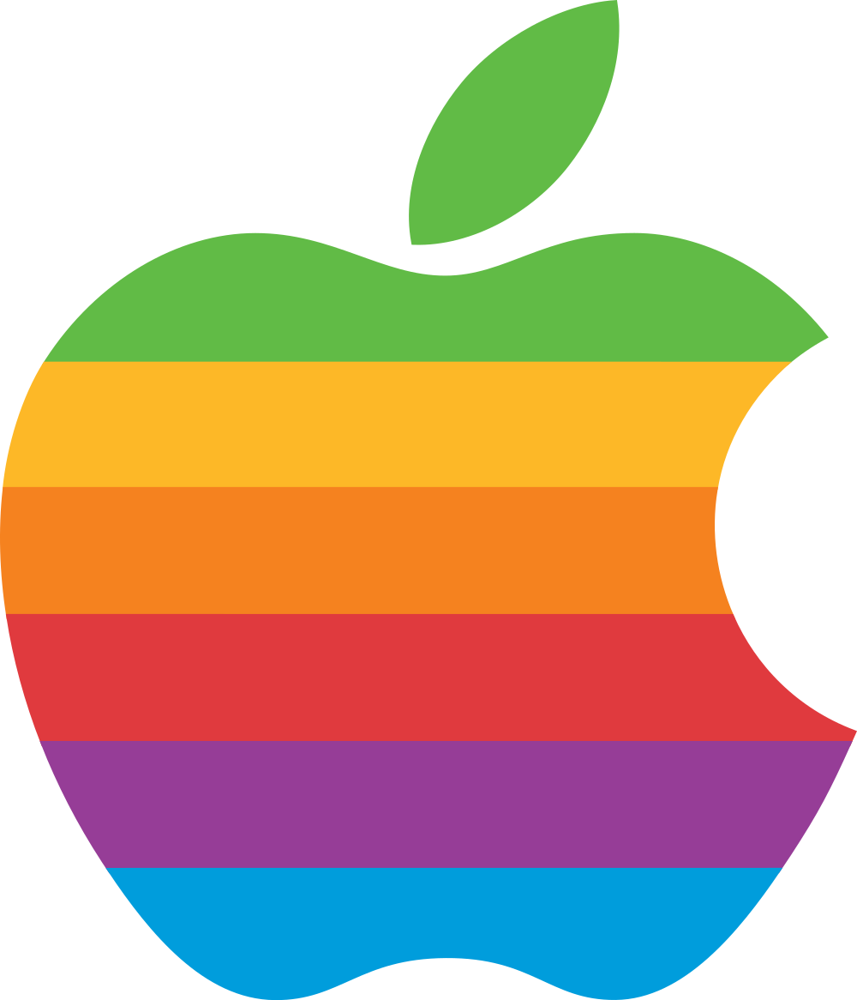
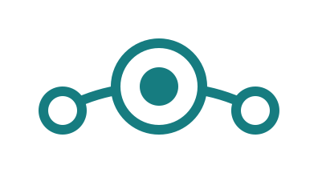
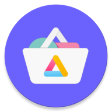
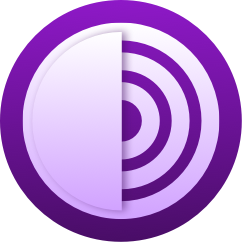

# [Awesome Privacy *(unfinished)*](.)
### *An  list of services and tools that protect your privacy and enhance your security.*

<!--
## Notice for GitHub!
GitHub, as a website, is not private. GitHub is owned by Microsoft and they've implemented their own little tracker tidbits into the official website. If you would like to ensure your privacy while viewing this document, I recommend viewing the [Codeberg mirror](https://codeberg.org/aura/awesome-privacy) of this repository. [Learn more on mirroring to Codeberg](https://codeberg.org/Recommendations/Mirror_to_Codeberg).
-->

## Icon Key
On some of the listed software, you may see some icons next to the name of the product. These help distinguish some quick information, like what operating systems support a certain software.

### Operating Systems

 Runs on Android\
 Runs on iOS\
 Runs on Windows\
 Runs on macOS\
 Runs on Linux distributions

## Contents
- [Operating Systems](#operating-systems-1)
- [Android App Stores](#android-app-stores-)
- [Web Browsers](#web-browsers)

## Operating Systems

### Mobile Operating Systems
The stock version of Android installed on most phones (i.e., Google Pixel stock Android, Samsung One UI, Xiaomi MIUI, Oppo ColorOS) include loads of privacy-invasive apps and trackers by default, many of which you are unable to remove without special methods, such as rooting the Android device. However, there are many alternatives to the pre-installed operating system on your phone that can enhance your privacy and security.

#### Android-based 
These mobile operating systems are based on the AOSP - Android Open Source Project - and are modified versions on Android to protect your privacy and security.
-  [GrapheneOS](https://grapheneos.org/) - The private and secure mobile operating system with Android app compatibility. **Best for security.**
-  [LineageOS](https://lineageos.org/) - A free and open-source operating system for various devices, based on the Android mobile platform. **Best for anyone.**
-  [CalyxOS](https://calyxos.org/) - CalyxOS is an Android mobile operating system that puts privacy and security into the hands of everyday users.

#### Linux-based 
There are also mobile operating systems based on Linux distributions.
- [Ubuntu Touch](https://ubuntu-touch.io/) - Ubuntu Touch is the touch-friendly mobile version of the popular Ubuntu operating system. Originally designed and developed by Canonical Ltd, the project now resides with the UBports Foundation.
- [PureOS](https://pureos.net/) - A fully-convergent, user friendly, secure and freedom respecting OS for your daily usage.

### Desktop Operating Systems 
Windows and macOS are not the most private operating systems for desktops. Both send a lot of telemetry data back to their respective companies, and there isn't much you can do to disable it within each operating system's privacy settings. However, there are some other operating systems based on the open-source Linux kernel that can enhance your privacy and security.

#### For everyday use:
-  [Linux Mint](https://linuxmint.com/) - Linux Mint is an operating system for desktop and laptop computers. It is designed to work 'out of the box' and comes fully equipped with the apps most people need. **Best for Windows users.**
- [Fedora Linux](https://fedoraproject.org) - A beautiful, high-quality desktop, built on the latest open source technology. Trusted, powerful and easy. **Best for macOS users.**

#### For security experts:
-  [Qubes OS](https://www.qubes-os.org/) - Qubes OS is a free and open-source, security-oriented operating system for single-user desktop computing. Qubes OS leverages Xen-based virtualization to allow for the creation and management of isolated compartments called qubes. **Best for security.** 
-  [Tails](https://tails.net/) - Tails is a portable operating system that protects against surveillance and censorship. **Best for anonymity.**

## Android App Stores 
-  [F-Droid](https://f-droid.org/) - F-Droid is an installable catalogue of FOSS (Free and Open Source Software) applications for the Android platform. The client makes it easy to browse, install, and keep track of updates on your device. **Best for open-source apps.**
-  [Aurora Store](https://gitlab.com/AuroraOSS/AuroraStore) - Aurora Store is an unofficial, FOSS client to Google Play with bare minimum features. Aurora Store
allows users to download, update, and search for apps like the Play Store. It works perfectly fine
with or without Google Play Services or MicroG.
-  [Obtainium](https://github.com/ImranR98/Obtainium) - Obtainium allows you to install and update Apps directly from their releases pages, and receive notifications when new releases are made available. **Best for advanced users.**

## Web Browsers
### Mobile Web Browsers 
-  [Tor Browser](https://www.torproject.org/)  - Tor Browser for Android is the only official mobile browser supported by the Tor Project, developers of the world’s strongest tool for privacy and freedom online. **Best for anonymity.**
-  [Onion Browser](https://onionbrowser.com/)  - Onion Browser is the original free and open-source Tor-powered web browser for iOS. Onion Browser helps you access the internet with more safety and privacy, and no extra cost to you.

### Desktop Web Browsers 
-  [Tor Browser](https://www.torproject.org/)  - Tor Browser uses the Tor network to protect your privacy and anonymity. **Best for anonymity.**
-  [LibreWolf](https://librewolf.net/)  - A custom version of Firefox, focused on privacy, security and freedom. **Best for anyone.**